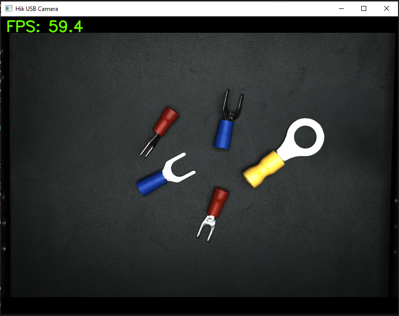
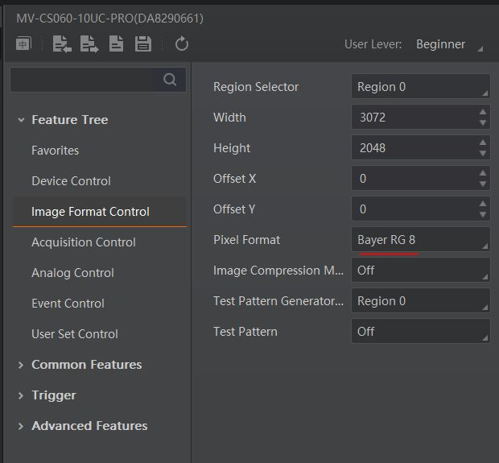

# Hik USB Camera Test with OpenCV

`test_hik_usb.py` - Скрипт для захвата видео с USB3-камеры Hikrobot (MV-CS060-10UC-PRO) с использованием **Hikvision SDK** и **OpenCV**.
`test_hik_usb_withGUI.py` - Захват видео с камеры обернутый в GUI **PySide6**

  
*(Пример: захват наконечников в разрешении 3072×2048 с отображением в окне 800×600)*

## Возможности

- Автоматический поиск первой USB-камеры Hikrobot
- Настройка Bayer RG8 (с fallback на Mono8)
- Масштабирование изображения с сохранением пропорций и центрированием
- Отображение FPS в реальном времени
- Корректная очистка ресурсов при выходе (по 'q' или Ctrl+C)

Тестировалось на модели **MV-CS060-10UC-PRO** (Sony IMX178) при разрешении 3072×2048 → FPS ≈ 58–60, камера подключена к полноценному USB3-порту.

## Установка

- Установленный **Hikrobot MVS**: Machine Vision Software MVS V4.6.3
- Установленный **Hikrobot SDK**: Machine Vision Industrial Camera SDK V4.7.0 Runtime Package
- Скачать: https://www.hikrobotics.com/en/machinevision/service/download 
- После установки скопировать файлы: `CameraParams_const.py`, `CameraParams_header.py`, `MvCameraControl_class.py`, `MvErrorDefine_const.py` и `PixelType_header.py` из `C:\Program Files (x86)\MVS\Development\Samples\Python\MvImport\` в папку со скриптом
- Тестировалось на `Python 3.12.10`
- Требуемые библиотеки:
    ```bash
    pip install numpy opencv-python
    ```
- Для работы с GUI `test_hik_usb_withGUI.py`
    ```bash
    pip install PySide6
    ```

## Запуск

1. Подключить камеру по USB
2. Запусти скрипт:
    ```bash
    python test_hik_usb.py
    ```
    или
    ```bash
    python test_hik_usb_withGUI.py
    ```
3. Нажми `q` для выхода

  
*(Вывод в консоль этапов работы программы)*

## Структура проекта

```
.
├── test_hik_usb.py             # основной рабочий скрипт
├── test_hik_usb_withGUI.py     # рабочий скрипт с GUI PySide6
├── CameraParams_const.py       # из SDK (из Hikrobot SDK)
├── CameraParams_header.py      # из SDK (из Hikrobot SDK)
├── MvCameraControl_class.py    # из SDK (из Hikrobot SDK)
├── MvErrorDefine_const.py      # из SDK (из Hikrobot SDK)
├── MvISPErrorDefine_const.py   # из SDK (из Hikrobot SDK)
├── PixelType_header.py         # из SDK (из Hikrobot SDK)
└── README.md                   # документация
```

> Файлы из SDK (MvCameraControl_class.py, PixelType_header.py...) лицензированы Hikrobot и должны быть взяты из установленного MVS

## Лицензия
MIT License
Можешь свободно использовать, модифицировать и распространять.
Если используешь в коммерческом проекте — буду рад упоминанию или звёздочке ⭐

Если скрипт помог — поставь ⭐ репозиторию, будет приятно 😄


## Дополнительно:

### Как убедиться на 100%, какой именно паттерн у твоей камеры

Зайди в **MVS софт** (Hikrobot MVS) → Device → Features → Image → Pixel Format
Там должно быть написано Bayer RG 8 или Bayer GR 8 или Bayer GB 8 или Bayer BG 8.



Самый надёжный способ — посмотреть на **красный объект** (например, красную ручку/помаду/яблоко):
 - если красный → синий/голубой оттенок → это Bayer **RG** → используй `COLOR_BayerRG2BGR`
 - если красный → красный/оранжевый нормальный → это Bayer **BG** → используй `COLOR_BayerBG2BGR`

